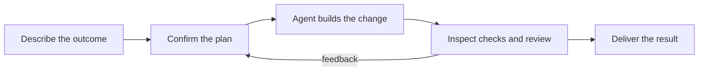

# Creator Engine

Creator Engine helps you turn an idea into working software with an AI coding
agent. Describe the change, agree on what success looks like, and get a clear
record of the work, checks, and review materials before delivery.

[](https://github.com/creator-engine/creator-engine/releases)
[](https://github.com/creator-engine/creator-engine/actions/workflows/validate.yml)
[](./LICENSE)

## Contents

- [What is Creator Engine?](#what-is-creator-engine)
- [How CE helps you build](#how-ce-helps-you-build)
- [Quickstart](#quickstart)
- [Ways to use CE](#ways-to-use-ce)
- [Project status](#project-status)
- [Documentation](#documentation)
- [License](#license)

## What is Creator Engine?

Creator Engine is a terminal companion for the coding agent you already use.
It helps you state the outcome you want, keep a change focused, and inspect the
result with the checks and review information needed to decide whether it is
ready. You stay in charge of important decisions while your agent handles the
day-to-day implementation work.

## How CE helps you build



Start with the result you want. CE helps turn it into a focused plan, keeps the
agent on that plan, and gathers the checks and review materials you need before
delivery. Read the full journey in [How CE Builds Software](./docs/guide/how-ce-builds-software.md).

## Quickstart

### Install

Run the public bootstrap installer:

```bash
curl --proto '=https' --tlsv1.2 -fsSL https://creator-engine.dev/install.sh | bash
```

The installer sets up the `ce` command and checks that your environment is ready
for a first project.

### Start your first session

From the repository where you want to work, run:

```bash
ce onboard
```

`ce onboard` checks your local setup, prepares CE for the repository, and opens
your coding agent unless you opt out. Describe a small change in plain language,
confirm the plan, then use the resulting checks and review materials to decide
when it is ready.

For later sessions, run:

```bash
ce launch
```

### Useful commands

Use these commands for the usual journey:

```text
ce onboard       Set up CE for a repository and begin
ce launch        Open a working session with your coding agent
ce shape         Describe and refine a proposed change
ce scope         Save the agreed change details
ce drive --spawn Ask CE to start the implementation work
ce report        Read the resulting work and check summary
```

See the [CLI Reference](./docs/reference/cli.md) for every command and option.

## Ways to use CE

| Approach | Best for | What you do | Deeper guide |
| --- | --- | --- | --- |
| Guided mode | People who want to describe a goal and make key decisions | State the outcome, confirm the plan, and inspect the evidence | [Solo + CEO Mode Onboarding](./docs/guide/solo-ceo-onboarding.md) |
| Command-line mode | People who prefer direct terminal control | Use the commands yourself while CE organizes the work | [Solo + Dev Mode Onboarding](./docs/guide/solo-dev-onboarding.md) |

## Project status

Creator Engine v0.3.6 is the latest release, published July 12, 2026. See the
[CHANGELOG](./CHANGELOG.md) for release notes and [GitHub Releases](https://github.com/creator-engine/creator-engine/releases)
for downloadable release details. Creator Engine is in a public pilot phase,
with the core local workflow ready to try while some team features continue to
develop.

## Documentation

| Start here | Use it for |
| --- | --- |
| [Welcome](./docs/guide/welcome.md) | A product-level orientation before the first run |
| [Quickstart](./docs/guide/quickstart.md) | The copy-paste path for a first change |
| [How CE Builds Software](./docs/guide/how-ce-builds-software.md) | The full product journey |
| [Understanding CE](./docs/guide/understanding-ce.md) | Plain-language concepts and terminology |
| [Complete Walkthrough](./docs/guide/complete-walkthrough.md) | A fuller install-to-delivery narrative |
| [CLI Reference](./docs/reference/cli.md) | Every public `ce` command |
| [Contributing](./CONTRIBUTING.md) | How to contribute to this repository |
| [Security](./SECURITY.md) | Vulnerability reporting and security expectations |
| [Code of Conduct](./CODE_OF_CONDUCT.md) | Community conduct standards |

## License

Creator Engine is licensed under the [Apache License 2.0](./LICENSE).
