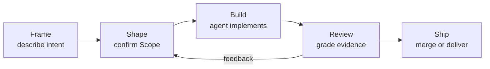

# Creator Engine

Creator Engine turns an idea into governed, working software through a guided AI-development journey where quality is enforced by evidence gates, not by trusting model output.

[](https://github.com/creator-engine/creator-engine/releases)
[](https://github.com/creator-engine/creator-engine/actions/workflows/validate.yml)
[](./LICENSE)

## Contents

- [What is Creator Engine?](#what-is-creator-engine)
- [How CE builds software](#how-ce-builds-software)
- [Quickstart](#quickstart)
- [Modes](#modes)
- [Project status](#project-status)
- [Documentation](#documentation)
- [License](#license)

## What is Creator Engine?

Creator Engine is a terminal-first governance layer for the coding agent you already use. You describe the change you want, confirm the Goal, Done-when, and Change-type, and CE runs the build loop with auditable evidence. The agent can draft, implement, test, and prepare review artifacts; CE keeps the work inside the confirmed boundary and holds privileged actions for human approval. Review is evidence-gated: you judge the diff, tests, and Completion Report against the Done-when you approved. A Budget can be added when a lane requires a cap, but it is not part of the default first journey.

## How CE builds software



The loop is Frame -> Shape -> Build -> Review -> Ship. Frame is ordinary conversation about the problem; Shape turns that intent into a Scope with Goal, Done-when, and Change-type; Build runs inside that Scope; Review checks artifacts and evidence; Ship lands the governed outcome or sends the work back with concrete feedback. Read the full stage guide in [How CE Builds Software](./docs/guide/how-ce-builds-software.md).

## Quickstart

### Install

Run the public bootstrap installer:

```bash
curl --proto '=https' --tlsv1.2 -fsSL https://creator-engine.dev/install.sh | bash
```

The installer verifies the signed install spec before persistent mutation, installs the validator from signed-manifest-pinned artifacts, proves the `ce` command, and stops at authenticated inventory. Later repository connection and environment changes happen through explicit plan/apply gates.

### First Guided Session

From the repository you want to use with CE, run:

```bash
ce onboard
```

`ce onboard` verifies the local install, initializes CE state, checks prerequisites, and opens the first governed agent pane unless you opt out. In the pane, describe the first small change in plain language. CE shapes that intent into a Scope; you confirm the Goal, Done-when, and Change-type; then the governed run builds, reports evidence, and prepares review.

For daily return sessions after onboarding:

```bash
ce launch
```

### Developer Mode

If you prefer to drive the pipeline yourself, use the canonical command path in [Creator Engine Quickstart](./docs/guide/quickstart.md). The core verbs are `ce brain init`, `ce launch`, `ce shape`, `ce scope`, `ce ratify`, `ce drive --spawn`, and `ce report`.

## Modes

| Mode | Best for | How it feels | Deeper guide |
| --- | --- | --- | --- |
| Guided / CEO mode | People who want to state intent and approve gates | You describe the goal, review the Scope, ratify the work, and judge evidence while the agent drives the mechanics | [Solo + CEO Mode Onboarding](./docs/guide/solo-ceo-onboarding.md) |
| Developer mode | People who want explicit command-line control | You run the CE verbs directly while CE wraps your agent session and gates privileged actions | [Solo + Dev Mode Onboarding](./docs/guide/solo-dev-onboarding.md) |

## Project status

The current release is reflected by the badge at the top of this README, [GitHub Releases](https://github.com/creator-engine/creator-engine/releases), and [CHANGELOG.md](./CHANGELOG.md). Creator Engine is in a public pilot phase: the governed local journey is usable, and some team-scale automation remains opt-in while it matures.

## Documentation

| Start here | Use it for |
| --- | --- |
| [Welcome](./docs/guide/welcome.md) | A product-level orientation before the first run |
| [Quickstart](./docs/guide/quickstart.md) | The canonical copy-paste path for a first governed change |
| [How CE Builds Software](./docs/guide/how-ce-builds-software.md) | The stage model, Scope fields, and Completion Report vocabulary |
| [Understanding CE](./docs/guide/understanding-ce.md) | Plain-language concepts and terminology |
| [Complete Walkthrough](./docs/guide/complete-walkthrough.md) | A fuller install-to-ship narrative |
| [Pilot Runbook](./docs/guide/pilot-runbook.md) | Practical pilot operation and review flow |
| [CLI Reference](./docs/reference/cli.md) | Public `ce` command inventory |
| [Contributing](./CONTRIBUTING.md) | How to contribute to this repository |
| [Governance](./GOVERNANCE.md) | The governance model and authority boundaries |
| [Security](./SECURITY.md) | Vulnerability reporting and security expectations |
| [Code of Conduct](./CODE_OF_CONDUCT.md) | Community conduct standards |

## License

Creator Engine is licensed under the [Apache License 2.0](./LICENSE).
