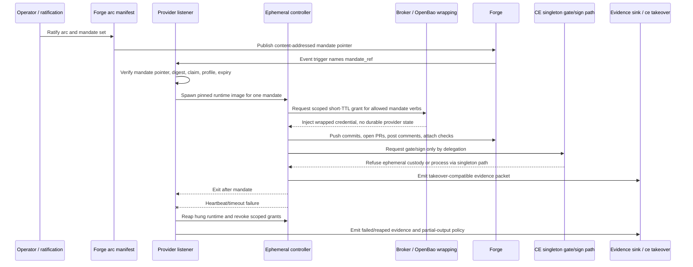

# Ephemeral Controller Provider Seam Design

Status: design-only

## Purpose

Define the common provider seam for event-spawned, self-retiring CE
controllers so the dark-factory dispatch direction can use multiple execution
providers without moving singleton gate custody, approval-wall custody, or
release-signing custody into ephemeral contexts.

Ephemeral controllers are spawned from forge events and ratified arc manifests.
They consume a pinned mandate pointer, perform one bounded unit of controller
work, publish all results back to the forge, emit auditable evidence, and exit.
They do not become a durable controller of record and do not hold durable state
between invocations.

## Custody and Authority Model

The seam separates rented compute from CE authority:

- Arc ratification, mandate compilation, work claims, singleton merge-gate
  custody, approval-wall marker minting and verification, and SSHSIG signing
  deputy custody remain in the CE control plane.
- Ephemeral providers receive only the minimum bounded material needed to run
  the mandate named by the content-addressed pointer.
- Provider output is public or value-free forge state: commits, pull requests,
  comments, labels, check records, and evidence packet references.
- Provider state is disposable. If a provider exits, crashes, or is revoked,
  the next invocation reconstructs context from the forge and evidence store,
  not from provider-local memory.

An ephemeral controller may be granted read/report authority or narrowly scoped
forge mutation authority for its mandate. It is never granted:

- merge-gate singleton custody;
- approval-wall signing or mint authority;
- `ce-root-v1` signing authority;
- seat-relaunch, `ce launch`, or canonical controller launch authority;
- OpenBao root, unseal, import, wall-secret, or signing-deputy credentials;
- controller-key material or any long-lived provider credential.

Gate or signing actions requested by an ephemeral controller are routed back to
the self-hosted singleton path or refused. Provider identity is evidence, not
authority. Ephemeral controllers never relaunch seats or invoke `ce launch`;
canonical launch authority remains exclusively with the persistent controller
path.

## Non-Goals

- No implementation code, workflow wiring, container image build, or provider
  integration in this unit.
- No promotion of any ephemeral-controller provider to non-read-only posture.
- No change to the approval capability wall, queue daemon, merge gate, or
  signing deputy protocols.
- No new source of gate, approval, release, or Operator authority.
- No replacement for governed work claims, PR carriers, or `ce validate-pr`.
- No durable provider database, queue, transcript store, or hidden work memory.

## Threat Model

| Threat | Control |
| --- | --- |
| Provider compromise tries to merge, enqueue, approve with wall authority, or sign release artifacts | Ephemeral controllers never receive singleton-gate, approval-wall, or signing-deputy credentials; gate/sign verbs from provider identities fail closed and must be delegated to the self-hosted singleton path. |
| Inline prompt injection changes the mandate after ratification | Providers receive a content-addressed mandate pointer, not inline prompt text; the launcher resolves the pointer to immutable bytes and verifies the digest before execution. |
| Provider-local state becomes hidden authority | The provider contract has no durable provider state; all outputs are forge results or auditable evidence packets. A resumed run must reconstruct from the forge and mandate/evidence refs. |
| Managed cloud agent receives broad tenant credentials | Managed clouds are compute rental only. They receive no gate custody, signing custody, approval-wall access, controller-key material, or durable CE credential. |
| GitHub Actions job is treated as a controller with gate posture | GitHub Actions is restricted to read/report or low-authority sweeps using the job-scoped `GITHUB_TOKEN`; it cannot become gate-capable or signing-capable. |
| Self-hosted webhook listener becomes an always-on controller | The listener is only a spawn surface. Each mandate runs in a runtime image pinned by SHA and exits after completion; no provider state or persistent credentials remain in the spawned container. |
| Evidence packet becomes an approval substitute | Evidence records describe mandate, identity, inputs, outputs, validation, and refusals only; they do not carry wall markers, private keys, gate custody, or Operator approval. |
| Harness drift promotes an unproven provider near the gate | The seam requires validation before non-read-only promotion, plus harness parity matrix rows before any gate-adjacent work. |
| Takeover loses ephemeral work context | Evidence packets are shaped for `ce takeover` ingestion so succession reconstructs mandate state, output refs, and refusal history from durable records. |

## Provider Contract

Endpoint class: `ephemeral_controller.run_v1`

Request fields:

```json
{
  "mandate_ref": {
    "uri": "ce-mandate://sha256/<64-hex>",
    "sha256": "<64-hex>",
    "media_type": "application/vnd.ce.mandate+yaml",
    "ratification_ref": "operator-ratification:<id>",
    "arc_manifest_ref": "ce-arc://<id>#<entry>",
    "work_claim_ref": "ce-work-claim:<id>"
  },
  "provider_profile": "self_hosted_webhook_v1",
  "authority_tier": "read_report|bounded_forge_mutation",
  "result_targets": {
    "repo": "OWNER/REPO",
    "branch_prefix": "ce-ephemeral/",
    "evidence_sink": "ce-evidence://takeover-compatible"
  },
  "expires_at": "2026-07-07T16:30:00Z",
  "nonce": "<opaque-random>"
}
```

Rules:

- `mandate_ref` is the only work instruction. The provider must not accept
  inline prompt text, mutable branch paths, chat transcript fragments, or
  provider-local replay data as the mandate.
- The mandate file is content-addressed and pinned. The launcher resolves the
  bytes, verifies `sha256`, and records the resolved digest before provider
  execution.
- `ratification_ref`, `arc_manifest_ref`, and `work_claim_ref` bind the spawned
  controller to the ratified dark-factory arc and the live forge work item.
- `authority_tier` is an upper bound. Provider profile rules may further reduce
  it; no profile may raise it into gate, approval-wall, or signing authority.
- `expires_at` bounds launch and credential grants. Expired mandates refuse
  before resolving credentials or starting work.

Response fields:

```json
{
  "mandate_sha256": "<64-hex>",
  "provider_profile": "self_hosted_webhook_v1",
  "provider_instance_id": "ephemeral-controller:<id>",
  "result": "completed|refused|failed|expired",
  "forge_results": {
    "commits": ["<sha>"],
    "pull_requests": ["https://github.com/OWNER/REPO/pull/123"],
    "comments": ["https://github.com/OWNER/REPO/issues/456#issuecomment-..."],
    "checks": ["check-run:<id>"]
  },
  "evidence_packet_ref": "ce-evidence://ephemeral-controller/<id>",
  "created_at": "2026-07-07T16:00:00Z",
  "completed_at": "2026-07-07T16:12:00Z"
}
```

The response is a forge-results-out record. It names durable forge artifacts and
the evidence packet; it does not name a provider-local database row, hidden
queue offset, reusable session, or cached authority.

Schema follow-up: implementation slices must materialize the request/response
contract as `validators/creator_engine_validator/schemas/ephemeral-controller-run-v1.schema.yaml`
and register the endpoint as `ephemeral_controller.run_v1` in the CE schema
reference/catalog before any provider consumes it. The evidence packet shape
must likewise become
`validators/creator_engine_validator/schemas/ephemeral-controller-evidence-v1.schema.yaml`
and register the schema id `ce.ephemeral_controller.evidence.v1` with an owner,
version, compatibility policy, and validator check.

## Reference Implementation: NanoClaw

Operator decision 2026-07-07 sets the T0 bar for this design: by 2026-07-21,
NanoClaw is the named reference implementation for the ephemeral controller
loop. The reference loop is event-spawn -> mandate -> post -> self-retire:
receive a forge event, resolve the pinned mandate, run exactly one bounded
controller unit, post forge-visible results and evidence, and retire without
durable provider state.

NanoClaw binds to provider profile `self_hosted_webhook_v1`. The self-hosted
webhook listener is the spawn surface; the NanoClaw harness is the proving
surface for pointer verification, one-mandate runtime launch, bounded forge
mutation, evidence emission, timeout/reap behavior, and self-retirement. Other
profiles may be implemented later, but they do not replace NanoClaw as the T0
reference harness for the event-spawned loop.

## Provider Profiles

### Provider 1: Self-Hosted Webhook Receiver

Profile id: `self_hosted_webhook_v1`

Purpose: default event-spawn provider for forge events that need CE containment
and bounded forge mutation.

Shape:

- A thin self-hosted webhook receiver accepts ratified forge events such as PR,
  push, issue label, comment command, merge event, or schedule tick.
- The receiver is deployed from IaC and fed by ratified SSOT configuration for
  event bindings, image digest, timeout, heartbeat, and credential policy. A
  convention-configured or hand-mutated listener is not a conforming spawn
  surface.
- The receiver maps the event to a pinned mandate pointer compiled from the
  forge/arc manifest.
- It spawns the canonical CE runtime image by immutable digest, for example
  `ce-controller-runtime@sha256:<image-digest>`.
- The spawned process runs exactly one mandate and exits. Runtime launch uses a
  disposable container/process form such as `docker run --rm` or the ratified
  equivalent for the substrate.
- The spawned container has no persistent credentials. Secrets and scoped forge
  tokens are injected through the broker/OpenBao wrapping path with short TTLs,
  mandate binding, and no value in evidence.
- The receiver is an always-on listener, not an always-on controller. It does
  not hold merge-gate custody, signing custody, approval-wall custody, or
  provider-local work state.

Allowed posture:

- Read/report mandates.
- Bounded forge mutation mandates such as branch push, PR open, PR comment,
  evidence upload, or label/comment updates when the mandate grants them.
- Gate/sign requests are refused locally and recorded in evidence.

### Provider 2: GitHub Actions Low-Authority Jobs

Profile id: `github_actions_low_authority_v1`

Purpose: forge-hosted compute for read/report work and low-authority sweeps.

Shape:

- Triggered by native GitHub events or schedules.
- Resolves the pinned mandate pointer from the repository or approved artifact
  store.
- Uses only the job-scoped `GITHUB_TOKEN` and repository permissions explicitly
  declared for that workflow job.
- Exits at job completion or timeout. No CE provider state survives the job.

Allowed posture:

- CI commentary, stale detection, label triage, readiness reports, evidence
  summaries, and other low-authority sweeps.
- No gate-capable or signing-capable controller posture.
- No approval-wall marker minting, no queue-daemon enqueue authority, and no
  release signing.
- No forge mutation beyond what the specific `GITHUB_TOKEN` job permission
  grants.

### Provider 3: Managed Agent Clouds

Profile id: `managed_agent_cloud_compute_v1`

Purpose: rented CPU/context from managed agent products while keeping CE custody
in CE infrastructure.

Shape:

- CE sends only a pinned mandate pointer and minimal bounded context to the
  managed provider.
- The managed provider returns forge-visible work products or value-free
  evidence for CE to publish.
- The provider does not receive CE gate custody, signing custody,
  approval-wall access, controller-key material, OpenBao credentials, or durable
  source-host credentials.

Allowed posture:

- Read/report, analysis, draft patch preparation, scheduled sweeps, or bounded
  non-gate work where the provider's trust boundary is acceptable.
- Gate/sign operations are delegated back to the self-hosted singleton path.
- Any attempt by the managed provider to mint approval-wall markers, enqueue,
  merge, sign, or request signing-deputy credentials is refused and recorded.

## Orphan Detection and Reap Policy

Every provider profile must define an orphan detector, a timeout or heartbeat
contract, a reap mechanism, and a partial-output cleanup policy before it may
run non-read-only work. A normal `docker run --rm` exit is not sufficient:
hung ephemerals must be detected and reaped.

Common rules:

- Each run has a provider instance id, mandate digest, work claim, deadline,
  and heartbeat expectation recorded before work starts.
- A missing heartbeat after the profile timeout, an exceeded `expires_at`, or a
  provider-native timeout creates result `failed` with reason
  `ephemeral_orphan_reaped`.
- Reap emits evidence before cleanup when possible. If the runtime cannot emit,
  the listener or provider wrapper emits a failure packet naming the last known
  forge artifacts and the cleanup decision.
- Partial forge outputs are never silently deleted. Branches or comments created
  by the ephemeral may be updated with a superseding failure note, checks are
  concluded failed or cancelled, draft pull requests are marked abandoned when
  the mandate permits, and evidence records list every artifact left for human
  or controller follow-up.

Profile-specific policy:

- `self_hosted_webhook_v1`: the IaC-managed listener owns the watchdog. The
  spawned runtime must heartbeat to the listener or evidence sink at a fixed
  cadence below the mandate TTL. On missed heartbeat or timeout, the listener
  kills the process/container, revokes wrapped grants, waits for container
  cleanup, and writes the failure evidence packet. NanoClaw must prove this
  path for T0.
- `github_actions_low_authority_v1`: GitHub Actions job timeout and workflow
  cancellation are the detector and reap surface. The job must trap cancellation
  where the platform allows, upload partial evidence, and leave any comments or
  labels with a failure/superseded marker rather than deleting them.
- `managed_agent_cloud_compute_v1`: CE records the provider request id and a CE
  watchdog deadline before sending the mandate pointer. On provider timeout,
  lost callback, or expired mandate, CE refuses the result, revokes any bounded
  publication grant, records failure evidence, and only publishes returned work
  through a later self-hosted path if a persistent controller revalidates it.

## Gate and Refusal Requirements

All providers share these fail-closed rules:

- A missing, mutable, non-content-addressed, or digest-mismatched mandate
  pointer refuses before execution.
- A missing or stale work claim refuses before execution.
- An expired mandate refuses before credential resolution.
- A provider profile that is not explicitly recognized refuses.
- Requested authority above the profile maximum refuses.
- Gate, queue-enqueue, approval-wall mint, approval-wall secret access,
  signing-deputy, `ce-root-v1`, OpenBao root/unseal/import, or controller-key
  requests from an ephemeral identity refuse regardless of mandate text.
- Seat relaunch, `ce launch`, or canonical controller launch requests from an
  ephemeral identity refuse regardless of mandate text. Relaunch remains a
  persistent-controller responsibility.
- Provider output that cannot be written to forge-visible targets or the
  evidence sink refuses promotion and is treated as incomplete.
- Non-read-only promotion requires seam validation evidence. Gate-adjacent work
  additionally requires harness parity matrix rows for the provider and a
  green promotion state.

Refusals are not silent. Each refusal emits an evidence packet with the refused
verb, provider identity, mandate digest, reason code, and timestamp, with no
secret material.

## Evidence Packet Shape

Each run emits a takeover-compatible value-free packet:

```json
{
  "schema": "ce.ephemeral_controller.evidence.v1",
  "mandate_sha256": "<64-hex>",
  "mandate_ref": "ce-mandate://sha256/<64-hex>",
  "arc_manifest_ref": "ce-arc://<id>#<entry>",
  "ratification_ref": "operator-ratification:<id>",
  "work_claim_ref": "ce-work-claim:<id>",
  "provider_profile": "self_hosted_webhook_v1",
  "provider_instance_id": "ephemeral-controller:<id>",
  "runtime_image_ref": "ce-controller-runtime@sha256:<image-digest>",
  "authority_tier": "bounded_forge_mutation",
  "credential_grants": [
    {
      "grant_ref": "broker-grant:<id>",
      "purpose": "forge-branch-push",
      "expires_at": "2026-07-07T16:20:00Z"
    }
  ],
  "forge_results": {
    "commits": ["<sha>"],
    "pull_requests": ["https://github.com/OWNER/REPO/pull/123"],
    "comments": [],
    "checks": []
  },
  "validation": {
    "mandate_digest_verified": true,
    "profile_refusals": [],
    "local_checks": ["git diff --check", "ce validate-pr"]
  },
  "refusals": [
    {
      "verb": "approval_wall.mint",
      "reason": "ephemeral_controller_not_wall_capable",
      "created_at": "2026-07-07T16:03:00Z"
    }
  ],
  "result": "completed",
  "created_at": "2026-07-07T16:00:00Z",
  "completed_at": "2026-07-07T16:12:00Z"
}
```

The packet must not include inline mandate text, private keys, OpenBao tokens,
unseal material, approval-wall verifier secrets, raw wall-signing material,
source-host tokens, model-provider secrets, or hidden provider transcript state.

`ce takeover` ingests the packet as reconstruction evidence. It may use the
mandate digest, forge result refs, validation summary, and refusal history to
decide what work was attempted and what must be resumed, but the packet never
authorizes gate/sign acts by itself.

## Lifecycle Flow



The lifecycle has no provider-local carryover edge. A later event repeats the
same pointer verification and spawn sequence.

## Validation Plan

Before any provider is promoted beyond read/report:

1. Add machine validation for mandate-pointer shape, digest pinning, expiry,
   provider profile recognition, and forbidden authority requests.
2. Add harness parity matrix rows for each ephemeral provider profile that may
   approach gate-adjacent work, including code support, launch wiring,
   live-proof, promotion approval, and explicit `gate-capable = no` until an
   Operator-ratified exception exists.
3. Prove self-hosted webhook spawns use canonical runtime images pinned by SHA
   and terminate after one mandate.
4. Prove broker/OpenBao wrapping injects only short-TTL mandate-scoped
   credentials and records no secret values in evidence.
5. Prove GitHub Actions provider jobs cannot exceed their declared
   `GITHUB_TOKEN` permissions and cannot call gate/sign paths.
6. Prove managed cloud providers receive no gate, signing, approval-wall,
   controller-key, OpenBao, or durable source-host custody.
7. Add refusal tests for gate, approval-wall, signing-deputy, and controller-key
   requests from every provider identity.
8. Add `ce takeover` ingestion tests for ephemeral evidence packets, including
   completed, failed, refused, and expired runs.
9. Run full local `ce validate-pr` before every push of any implementation
   slice.

Gate-adjacent work remains blocked until the seam validation and harness matrix
evidence are present. Even then, gate/sign custody stays outside the ephemeral
controller.

## Open Operator Questions

- What store is ratified for content-addressed mandate files: repository blobs,
  release artifacts, object storage, or a CE evidence store namespace?
- What exact schema version should arc manifests use when compiling
  mandate-pointer entries for provider consumption?
- Which self-hosted runtime image digest is the first canonical profile target,
  and what process owns digest rotation?
- What is the maximum TTL for provider credential grants by profile and
  authority tier?
- Which forge events are allowed to spawn provider 1 in v1: issue label,
  comment command, PR update, merge event, schedule tick, or a smaller subset?
- Are managed agent clouds allowed to return draft patches directly to branches,
  or must CE re-apply their output through the self-hosted path?
- Where should ephemeral evidence packets live so `ce takeover` can discover
  them without depending on provider-local state?
- BLOCKING for implementation slices that resolve mandates: what component owns
  the `ce-mandate://sha256/` resolver, and what storage roots are permitted?
