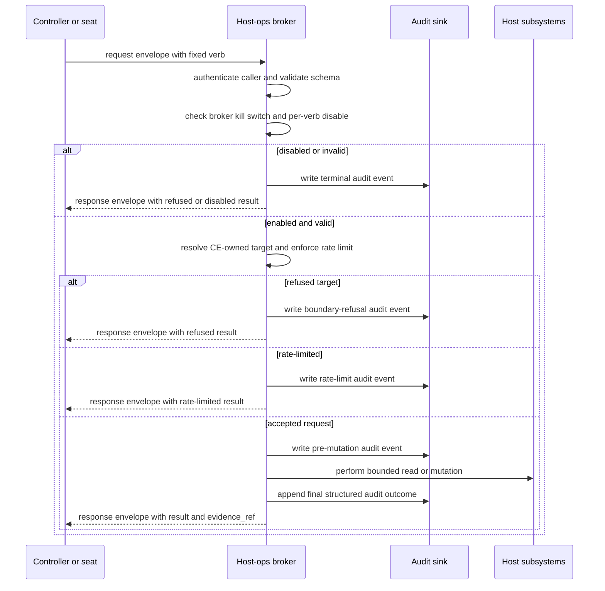

# Host-Ops Broker v1 Design

Status: design-only

## Purpose

Replace raw container-runtime socket reachability from controller and seat
containers with a small, systemd-supervised host-ops broker that exposes only
ratified, convergent host-state repair verbs.

The broker is a narrow repair layer. It is not an agent layer, not a command
runner, not a container orchestration API, and not a way for controllers or
workers to acquire general host authority. Its job is to perform bounded
repairs and status checks for CE-owned host resources when the agent layer is
too broken to repair itself.

## Authority Boundary

Controllers, seats, and workers call the broker through a constrained local
transport that authenticates the caller identity and request context. The broker
alone holds the host privileges needed to touch CE-owned systemd units, CE-owned
state roots, CE-owned container namespaces, and the configured OpenBao backup
path. Callers never receive those privileges directly.

Raw Docker, Podman, containerd, CRI, or equivalent runtime sockets are excluded
from all controller and seat containers. They are also excluded from broker verb
scope. A verb may internally call a runtime-specific tool only after enforcing
its own fixed schema, namespace bounds, image allow-list, rate limit, kill
switch, and audit write. There is no passthrough, interactive shell, arbitrary
subcommand, arbitrary image pull, arbitrary bind mount, or host socket relay.

The broker is supervised by systemd as a host service. Controllers and workers
do not spawn it inline. The unit must define a restart policy, bounded resource
limits, a dedicated service identity where practical, and dependencies on the
runtime and OpenBao services it needs to inspect.

## Complexity Budget

The broker must remain substantially smaller than the agent layer it protects.
The implementation budget for v1 is intentionally austere:

- One local request surface with one request envelope.
- One authorization and audit path shared by all verbs.
- One systemd unit and one broker config file.
- No embedded planner, queue, worker pool, LLM-facing agent loop, plugin system,
  shell parser, or unbounded command dispatcher.
- No verb that requires a caller-provided executable, script body, runtime
  socket, arbitrary environment, arbitrary mount, or arbitrary image reference.

Any proposed v1 expansion that needs durable task state, cross-host scheduling,
multi-step plans, or free-form execution belongs in a separate agent-layer
design, not in the host-ops broker.

## CE-Owned Namespace Model

Every mutating verb is constrained to CE-owned names and paths:

- Systemd unit names must match configured CE-owned unit allow-lists or prefixes.
- State roots must be under configured CE-owned root prefixes.
- Containers must carry CE-owned labels or names and must belong to the
  configured CE project namespace.
- OpenBao snapshot and restore-drill paths must resolve under configured backup
  roots.
- Runtime operations must not inspect, restart, prune, mount, or snapshot
  non-CE workloads.

The broker fails closed if ownership cannot be proven. A missing label, unknown
unit, symlink escape, path traversal, unpinned image, or mixed-tenant container
is treated as out of scope.

## Non-Goals

- No arbitrary command execution.
- No raw Docker, Podman, containerd, CRI, Kubernetes, or systemd socket exposure
  to callers.
- No general host administration interface.
- No cross-tenant or non-CE repair operations.
- No replacement for the agent layer or controller decision loop.
- No release-signing, secret custody, merge, approval, or gate authority.
- No implementation in this design unit.

## Threat Model

| Threat | Control |
| --- | --- |
| Controller compromise reaches the host runtime socket | Runtime sockets are not mounted into controller or seat containers; broker verbs are fixed, schema-checked, and audited. |
| Caller tries to smuggle arbitrary host commands through a repair verb | Verb schemas contain typed fields only; no command, argv, script, shell, environment, mount, or runtime-socket fields are accepted. |
| Caller targets non-CE resources by name collision | Every target is resolved against CE-owned allow-lists, labels, state-root prefixes, and unit-name policy before mutation. |
| Repeated failed repairs become a denial-of-service loop | Per-verb rate limits, broker-wide kill switch, per-verb disable flags, and explicit failure counters stop uncontrolled retries. |
| Ephemeral container verb becomes a generic container runner | Images must be CE-owned and digest-pinned; arbitrary pulls, tags without digests, non-CE registries, privileged mode, host socket mounts, and caller-provided bind mounts are refused. |
| Host UID or ownership repair damages existing state | State-root repair applies explicit desired UID/GID and mode from broker config, verifies path ancestry and current ownership first, and refuses ambiguous mixed ownership outside CE-owned roots. |
| Systemd repair restarts unrelated services | `repair-systemd-unit` and `restart-daemon` accept only CE-owned unit or daemon names from config and record the systemd unit identity in audit. |
| OpenBao backup or drill leaks secrets through audit | Snapshot and drill evidence records paths, hashes, sizes, and result classes only; no tokens, unseal material, raw snapshot content, or secret values are logged. |
| Broker compromise broadens authority silently | Small code budget, static verb list, explicit config, systemd supervision, structured audit, and kill switches make unexpected behavior easier to detect and disable. |
| Evidence is mistaken for approval | Audit records prove what the broker did; they do not approve a PR, release, merge, deployment, or secret-use decision. |

## Request Envelope

All verbs share one envelope:

```json
{
  "schema": "ce.host_ops.request.v1",
  "verb": "status",
  "request_id": "hostops-<opaque>",
  "caller": {
    "identity": "controller:<stable-id>",
    "role": "controller",
    "work_claim": "optional-work-claim-ref"
  },
  "params": {},
  "reason": "short operator-visible reason",
  "created_at": "2026-07-07T15:00:00Z"
}
```

Envelope checks:

- `schema` must equal `ce.host_ops.request.v1`.
- `verb` must be one of the v1 verbs.
- `request_id` must be unique for audit correlation.
- `caller.identity` and `caller.role` must be authenticated by the transport.
- `params` must validate against the selected verb schema.
- `reason` is required for mutating verbs and must be audit-safe text.
- `created_at` MUST be an RFC 3339 UTC timestamp with a trailing `Z`.
- Broker-wide kill switch and per-verb disable flags are checked before any
  host mutation.

## Response Envelope

```json
{
  "schema": "ce.host_ops.response.v1",
  "request_id": "hostops-<opaque>",
  "verb": "status",
  "result": "ok",
  "changed": false,
  "evidence_ref": "hostops-audit:<id>",
  "details": {}
}
```

`result` is one of `ok`, `already-converged`, `refused`, `rate-limited`,
`disabled`, `failed`, or `degraded`. `details` must be value-free and must not
include secrets, runtime socket paths, host credentials, OpenBao tokens, or
raw snapshot content.

## Kill Switches and Disable Flags

The broker has two disable layers:

- Broker-wide kill switch: stops every verb, including `status`, except a
  minimal health response that reports `disabled` and emits an audit event.
- Per-verb disable flag: stops one verb while leaving other verbs available.

Both layers must be read before rate-limit accounting and before any mutation.
Every disabled request emits an audit event with `result=disabled`,
`disabled_scope`, and `disabled_reason_ref`. Operators may use these records to
distinguish a deliberate safety stop from a broker outage.

The control path for both layers is out-of-band from the broker request API.
Flags live in the broker's root-owned host configuration/state directory, which
is outside every controller, seat, worker, state-root, scratch, and container
mount. They may be toggled only by the host Operator through a host-local
maintenance action or a broker admin utility that is not exposed on the normal
request transport. Runtime reload is allowed only from that root-owned source;
if the broker cannot read or authenticate the flag state, it fails closed as
broker-wide disabled. No v1 verb can set, clear, or bypass these flags, and
transport authorization must reject toggle attempts from contained agents.

## Rate-Limit Defaults

Rate limits are enforced per caller identity and per target where a target
exists. Defaults are intentionally conservative and may be tightened by config:

| Verb | Default limit |
| --- | --- |
| `status` | 30 requests per minute per caller |
| `restart-daemon` | 3 requests per 15 minutes per daemon |
| `prepare-owned-state-root` | 6 requests per hour per root |
| `rotate-attempt-log` | 6 requests per hour per subsystem |
| `repair-systemd-unit` | 3 requests per 15 minutes per unit |
| `run-ephemeral-container` | 3 requests per hour per caller and image |
| `prune-stopped-owned-containers` | 3 requests per hour per namespace |
| `snapshot-openbao` | 2 requests per hour per backup profile |
| `restore-drill-openbao` | 1 request per 6 hours per profile and canonical `snapshot_ref` |

Rate-limited requests emit audit records and do not mutate host state.
The `restore-drill-openbao` bucket key is
`caller_identity + ":restore-drill-openbao:" + profile + ":" +
canonical_snapshot_ref`, where `canonical_snapshot_ref` is the broker-resolved
snapshot reference under the configured backup root.

## Verb Contracts

### `status`

Purpose: report CE daemon, container, systemd, state-root, and OpenBao backup
health without mutating host state.

Parameter schema:

```json
{
  "include": ["daemons", "systemd", "containers", "state_roots", "openbao"],
  "target": "optional CE-owned target name",
  "detail": "summary|diagnostic"
}
```

Required fields: none. `include` defaults to all classes. `target`, if present,
must be a CE-owned daemon, unit, container namespace, state root, or OpenBao
profile. `detail=diagnostic` may include additional value-free error classes
but not secrets or raw logs.

Convergence invariant: the broker returns an accurate point-in-time health
summary or a degraded result naming the classes it could not inspect.

Idempotency: read-only; repeated calls have no host-state side effects.

Rate limit: 30 requests per minute per caller.

Audit event fields: common fields plus `include`, optional `target`,
`detail`, `health_summary`, `degraded_checks`, and `result`.

Kill-switch handling: broker-wide kill switch returns only disabled broker
health. A per-verb disable for `status` returns `disabled` without running
checks.

### `restart-daemon`

Purpose: restart a CE-owned daemon by configured daemon name.

Parameter schema:

```json
{
  "daemon": "ce-owned-daemon-name",
  "mode": "restart|try-restart",
  "wait_ready_seconds": 30
}
```

Required fields: `daemon`. `mode` defaults to `restart`. `wait_ready_seconds`
must be between 0 and 120. `daemon` must map to one configured CE-owned systemd
unit or supervised process.

Convergence invariant: the daemon is active, or the broker returns a failure
with the final systemd/process state and no further autonomous retries.

Idempotency: restarting an already active daemon is allowed but bounded by rate
limit; `try-restart` is a no-op if the daemon is inactive and reports
`already-converged`.

Rate limit: 3 requests per 15 minutes per daemon.

Audit event fields: common fields plus `daemon`, resolved `unit`, `mode`,
`pre_state`, `post_state`, `wait_ready_seconds`, `changed`, and `result`.

Kill-switch handling: broker-wide or per-verb disable refuses before resolving
or restarting the daemon.

### `prepare-owned-state-root`

Purpose: create or repair a CE-owned state root directory with the configured
owner, group, mode, and ancestry.

Parameter schema:

```json
{
  "root_name": "ce-state-root-name",
  "purpose": "controller|worker|openbao|daemon|cache",
  "ensure_empty": false,
  "expected_uid": 1000,
  "expected_gid": 1000,
  "mode": "0750"
}
```

Required fields: `root_name`, `purpose`. The path is resolved from broker
config, not from a caller-provided absolute path. UID, GID, and mode default to
the configured values for the named root and may only narrow to the configured
allow-list. `ensure_empty=true` is permitted only for cache roots marked
recreatable in config.

Convergence invariant: the state root exists under a configured CE-owned
prefix, is not a symlink escape, has the expected owner/group/mode, and contains
only allowed existing content for its purpose.

Idempotency: rerunning against a converged root is a no-op. Rerunning during a
partial repair repeats the same ownership and mode convergence without deleting
non-recreatable data.

Rate limit: 6 requests per hour per root.

Audit event fields: common fields plus `root_name`, `resolved_root_ref`,
`purpose`, desired owner/group/mode, `pre_owner_class`, `post_owner_class`,
`created`, `repaired`, and `result`. Audit records do not include directory
contents.

Kill-switch handling: broker-wide or per-verb disable refuses before any path
creation or ownership mutation.

Host ownership repair rule: the broker must treat host UID/GID repair as a
host-state action with explicit desired ownership, not as a container-side
best-effort fix. It must verify the target path on the host, reject ambiguous
mixed ownership outside CE-owned roots, avoid following untrusted symlinks, and
record whether ownership was already correct or repaired.

### `rotate-attempt-log`

Purpose: rotate an attempt or audit log for a configured CE subsystem without
changing unrelated logs.

Parameter schema:

```json
{
  "subsystem": "ce-subsystem-name",
  "log_kind": "attempt|audit|repair",
  "max_bytes": 10485760,
  "keep": 5
}
```

Required fields: `subsystem`, `log_kind`. `subsystem` must map to configured
CE-owned log files. `max_bytes` must be within the configured range. `keep`
must be between 1 and the configured maximum.

Convergence invariant: the active log is below `max_bytes`, rotated files are
within retention, ownership and mode match config, and unrelated files are not
touched.

Idempotency: if the active log is below threshold and retention already
converges, reruns are no-ops.

Rate limit: 6 requests per hour per subsystem.

Audit event fields: common fields plus `subsystem`, `log_kind`, `max_bytes`,
`keep`, `pre_size`, `post_size`, `rotated_count`, `deleted_count`, and `result`.

Kill-switch handling: broker-wide or per-verb disable refuses before file
inspection or rename.

### `repair-systemd-unit`

Purpose: re-enable and restart a failed CE-owned systemd unit.

Parameter schema:

```json
{
  "unit": "ce-owned.service",
  "action": "reenable-and-restart|reset-failed|restart-only",
  "wait_ready_seconds": 30
}
```

Required fields: `unit`. `unit` must be in the configured allow-list or match a
configured CE-owned prefix. `action` defaults to `reenable-and-restart`.
`wait_ready_seconds` must be between 0 and 120.

Convergence invariant: the unit is enabled when the selected action requires
enablement, is not in `failed` state, and is active after the ready wait, or the
broker returns the final systemd state as a failure.

Idempotency: rerunning on an enabled, active unit is a no-op or a bounded
`restart-only` operation, depending on `action`. Repeated repair is limited and
does not broaden the unit allow-list.

Rate limit: 3 requests per 15 minutes per unit.

Audit event fields: common fields plus `unit`, `action`, `pre_enabled`,
`pre_active_state`, `pre_sub_state`, `post_enabled`, `post_active_state`,
`post_sub_state`, `changed`, and `result`.

Kill-switch handling: broker-wide or per-verb disable refuses before systemd
inspection or mutation.

State-root ownership preflight: systemd repair must not assume the unit failure
is purely process state. For CE-owned units that depend on state roots, the
broker records ownership-related preflight findings and points operators to
`prepare-owned-state-root` rather than attempting broad recursive ownership
changes from the unit repair path.

### `run-ephemeral-container`

Purpose: run a short-lived container from a pinned CE-owned image for a
specific ratified maintenance task.

Parameter schema:

```json
{
  "task": "ce-maintenance-task-name",
  "image": "registry.example/ce/tool@sha256:<digest>",
  "args": ["task-specific", "bounded", "tokens"],
  "timeout_seconds": 300,
  "network": "none|ce-maintenance",
  "state_root": "optional-configured-state-root",
  "dry_run": false
}
```

Required fields: `task`, `image`. `image` must be CE-owned and digest-pinned;
tag-only references, latest tags, arbitrary registries, and caller-provided
pull policy are refused. `args` are task-specific tokens validated against the
configured task schema, not arbitrary argv. `timeout_seconds` must be within
the configured maximum. `network` defaults to `none`. `state_root`, if present,
must name a configured CE-owned root and mount only through broker-defined
read/write mode.

Convergence invariant: the container exits successfully within timeout, leaves
no running container behind, writes only to allowed CE-owned paths, and emits a
value-free run result.

Idempotency: tasks must declare their own idempotency class in broker config.
The broker refuses tasks not marked repeat-safe or guarded by an idempotency key.
Repeated dry runs do not mutate state.

Timeout and partial-write handling: when `timeout_seconds` expires, the broker
sends the configured graceful stop signal to the container init, waits a
configured grace window no longer than 30 seconds, then sends the configured
hard kill signal. Tasks that mount `state_root` must declare one write policy in
broker config: scratch-only rollback, atomic replace from a task-owned staging
path, or leave-partial-with-marker. The broker never deletes uncertain live
state. If a timeout happens during a `state_root` write, the selected policy
determines whether staged data is removed or partial data is left under the
configured root with an audit-safe partial marker for operator triage. If the
runtime reports the container still running or stopping after the hard kill, the
result is `failed` when final state is observable and `degraded` when the
runtime cannot confirm final state; either result blocks further runs for the
same task and state root until operator review or rate-limit expiry.

Rate limit: 3 requests per hour per caller and image.

Audit event fields: common fields plus `task`, `image_digest`, `args_shape`,
`timeout_seconds`, `network`, optional `state_root`, `container_id_ref`,
`exit_code`, `duration_ms`, `changed`, and `result`. Audit does not include
environment secrets, token values, stdout containing secrets, or mounted file
contents.

Kill-switch handling: broker-wide or per-verb disable refuses before any image
resolution or container creation.

### `prune-stopped-owned-containers`

Purpose: remove stopped containers that are provably in CE's own namespace.

Parameter schema:

```json
{
  "namespace": "ce-project-namespace",
  "older_than_seconds": 3600,
  "max_remove": 20,
  "dry_run": false
}
```

Required fields: `namespace`. The namespace must match configured CE labels or
name prefixes. `older_than_seconds` must be at least the configured grace
period. `max_remove` must be between 1 and the configured maximum.

Convergence invariant: stopped CE-owned containers older than the threshold are
removed up to `max_remove`; running containers and non-CE containers are
untouched.

Idempotency: after the stopped set is pruned, reruns return
`already-converged`.

Rate limit: 3 requests per hour per namespace.

Audit event fields: common fields plus `namespace`, `older_than_seconds`,
`max_remove`, `dry_run`, `candidate_count`, `removed_count`,
`skipped_not_owned_count`, and `result`.

Kill-switch handling: broker-wide or per-verb disable refuses before runtime
listing or removal.

### `snapshot-openbao`

Purpose: trigger an OpenBao snapshot to the configured backup path.

Parameter schema:

```json
{
  "profile": "openbao-backup-profile",
  "destination": "configured-destination-name",
  "label": "operator-safe-label",
  "verify_after_write": true
}
```

Required fields: `profile`, `destination`. Both fields must resolve through
broker config. `label` is optional audit-safe text and cannot influence the
resolved path except through a sanitized filename suffix. `verify_after_write`
defaults to true.

Convergence invariant: a snapshot is written under the configured backup root,
has expected ownership and mode, and, when requested, passes the configured
post-write verification.

Idempotency: snapshots are append-only artifacts. Repeating the same request
creates at most one new timestamped snapshot per accepted invocation and never
overwrites an existing snapshot.

Rate limit: 2 requests per hour per backup profile.

Audit event fields: common fields plus `profile`, `destination`,
`snapshot_ref`, `snapshot_sha256`, `snapshot_size_bytes`, `verify_after_write`,
`verification_result`, and `result`. No tokens, unseal keys, raw snapshot
content, or secret values are logged.

Kill-switch handling: broker-wide or per-verb disable refuses before requesting
OpenBao authority or opening the backup destination.

### `restore-drill-openbao`

Purpose: run a non-destructive OpenBao restore drill from a named snapshot to
verify restore readiness.

Parameter schema:

```json
{
  "profile": "openbao-drill-profile",
  "snapshot_ref": "configured-snapshot-reference",
  "mode": "metadata-verify|ephemeral-restore-verify",
  "timeout_seconds": 900
}
```

Required fields: `profile`, `snapshot_ref`. `snapshot_ref` must resolve under a
configured backup root. `mode` defaults to `metadata-verify`.
`ephemeral-restore-verify` may use only broker-owned scratch state and must not
replace the live OpenBao data directory. `timeout_seconds` must be within the
configured maximum.

Convergence invariant: the named snapshot is readable, matches recorded
metadata, and either passes metadata validation or can be restored into an
ephemeral drill environment without touching live OpenBao state.

Idempotency: drills are read-only with respect to snapshots and live OpenBao
state. Broker-owned scratch state is owned by the broker service account, is
created under a configured drill scratch root with one request-scoped directory,
and is cleaned on success and on terminal failure before the response is
returned.

Scratch cleanup guarantee: cleanup is the broker's responsibility, with an
additional host-local janitor allowed to retry directories that the broker marks
as cleanup-required. Cleanup is triggered at the end of every
`ephemeral-restore-verify` attempt, during broker startup reconciliation, and by
the janitor's bounded retry schedule. If cleanup fails, the broker leaves the
scratch directory root-owned or broker-owned with mode `0700`, writes only an
opaque `scratch_ref` and cleanup failure class to audit, returns `degraded`, and
refuses further ephemeral restore drills for the same profile until cleanup
succeeds or the Operator quarantines the directory. Any partially restored
secret data must remain only in the scratch directory, must never be copied into
live OpenBao state, and must never be summarized or sampled in audit evidence.

Rate limit: 1 request per 6 hours per profile and canonical `snapshot_ref`;
bucket key `caller_identity + ":restore-drill-openbao:" + profile + ":" +
canonical_snapshot_ref`.

Audit event fields: common fields plus `profile`, `snapshot_ref`,
`snapshot_sha256`, `snapshot_size_bytes`, `mode`, `scratch_ref`,
`verification_result`, `duration_ms`, and `result`. No raw snapshot content,
tokens, unseal material, or secret values are logged.

Kill-switch handling: broker-wide or per-verb disable refuses before reading
the snapshot or creating scratch state.

## Audit Record

Every invocation, including refused, disabled, rate-limited, and failed
requests, emits a structured audit record:

```json
{
  "schema": "ce.host_ops.audit.v1",
  "request_id": "hostops-<opaque>",
  "verb": "restart-daemon",
  "caller_identity": "controller:<stable-id>",
  "caller_role": "controller",
  "work_claim": "optional-work-claim-ref",
  "target_ref": "daemon:<name>",
  "params_redacted": {},
  "result": "ok",
  "changed": true,
  "rate_limit_key": "restart-daemon:<name>",
  "disabled_scope": null,
  "started_at": "2026-07-07T15:00:00Z",
  "finished_at": "2026-07-07T15:00:02Z",
  "broker_identity": "host-ops-broker:<instance-id>",
  "broker_version": "v1",
  "evidence": {}
}
```

`params_redacted` contains schema-safe parameter names and non-secret values
only. Evidence records may include statuses, counts, hashes, sizes, duration,
and result classes. They must not include credentials, raw logs containing
secret material, OpenBao tokens, runtime socket paths exposed to callers, raw
snapshot content, or private host topology. `started_at` and `finished_at` MUST
be RFC 3339 UTC timestamps with trailing `Z`.

## Operations Flow



For mutating verbs, the pre-mutation audit event is mandatory and fail-closed:
if it cannot be written, the broker returns `failed` and does not mutate host
state. The final audit append is post-mutation by necessity because it carries
the observed result. If mutation happened and the final audit append fails, the
broker returns `degraded`, writes to the system journal, and rate-limits further
mutations until the audit sink is healthy or the Operator disables the broker.

## Failure and Degradation Handling

- Invalid schema: return `refused`; emit audit with validation error class.
- Unknown or non-CE target: return `refused`; emit audit with boundary error.
- Broker-wide disabled: return `disabled`; emit disabled audit.
- Per-verb disabled: return `disabled`; emit disabled audit for that verb.
- Rate-limited: return `rate-limited`; emit rate-limit audit.
- Runtime or systemd unavailable: return `degraded` for `status`, `failed` for
  mutating verbs, and do not fall back to raw socket exposure.
- OpenBao unavailable: snapshot and drill verbs fail closed; no fallback to
  unmanaged file copies, stale tokens, or live data-directory mutation.
- Partial mutation: return `failed` or `degraded` with final observed state and
  preserve audit evidence for operator triage.
- Repeated failures: after three failures for the same caller, verb, and target
  within the configured window, the broker should self-disable that target or
  verb until operator review.

The bottom-out path below the broker is Operator intervention or host
reprovisioning. The broker must not recursively spawn agents, mint broader
credentials, or attempt autonomous recovery beyond the named verb.

## Validation Plan

The implementation unit for this design should prove:

- Schema tests accept valid requests and reject extra, unknown, or command-like
  fields for every verb.
- Boundary tests prove raw runtime sockets are not mounted into controller or
  seat containers and are never accepted as request parameters.
- Unit allow-list tests prove systemd verbs cannot touch non-CE units.
- Path tests prove state-root and OpenBao paths cannot escape configured roots,
  including symlink and traversal attempts.
- Image tests prove `run-ephemeral-container` requires CE-owned digest-pinned
  images and refuses tag-only references, arbitrary registries, privileged mode,
  host socket mounts, and caller-provided bind mounts.
- Idempotency tests rerun each verb against already-converged state.
- Rate-limit tests cover accepted, refused, disabled, and rate-limited requests.
- Audit tests cover every result class and verify no secrets, tokens, snapshot
  bytes, raw logs, or raw socket paths are recorded.
- Systemd supervision tests verify the broker unit starts, restarts on failure,
  and cannot be bypassed by controller-spawned inline execution.
- OpenBao drill tests prove restore drills are non-destructive against live
  OpenBao state.

## Open Operator Questions

- What local transport and caller-auth mechanism should v1 use for controller
  and seat requests?
- Where should audit records be stored so they survive broker restart without
  putting secret material in the repository?
- Which exact CE-owned unit, daemon, state-root, container-label, and backup
  allow-lists are ratified for the first deployment?
- What code-size or dependency ceiling should be used as the measurable
  complexity budget?
- Which CE image registry and signing or provenance check defines "CE-owned"
  for pinned ephemeral images?
- Should restore drills run only metadata verification in v1, or is an
  ephemeral restore environment required for acceptance?
- Which repeated-failure thresholds should cause automatic per-target disable
  versus operator-only review?
