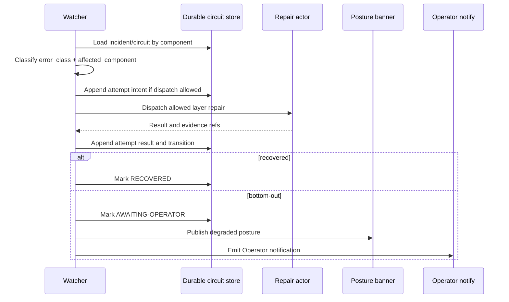

# Recursion Bottom-Out Policy Design

Status: design-only; first implementation slice ready

## Purpose

Prevent autonomous repair loops from recursing indefinitely when the same
blocking condition survives repeated repair attempts. The policy turns repeated
same-condition repair failure into a durable `AWAITING-OPERATOR`
circuit-breaker state, halts further self-repair dispatch for that incident,
and requires a human reset before autonomous repair may resume.

This applies to controller continuity, watcher-driven daemon repair, agent
repair, host-ops broker repair, takeover succession, posture display, and
Operator notification surfaces. It is a policy and data-contract design, not an
implementation unit.

## Existing Failure Mode

Current repair orchestration can observe a failure, launch a repair actor, and
then observe the same failure again after the repair actor exits or restarts.
Without a hard bottom-out rule, the system can spend quota and wall-clock time
on an unbounded loop:

- Watcher observes an unhealthy agent, daemon, broker verb, or host substrate.
- Controller or daemon dispatches a repair action.
- The action fails, partially repairs, or restarts the observer.
- The observer sees the same condition again and treats it as a fresh repair
  opportunity.
- The loop hides the original incident behind later repair noise and may
  degrade the host further.

The dangerous ambiguity is that repeated identical prose is neither necessary
nor sufficient to identify the same failure. A daemon may format a new message
for the same broken socket, while two different failures may share the same
text. The bottom-out policy therefore keys sameness structurally, not by raw
error text.

## Policy Model

Every autonomous repair run belongs to one incident. An incident has a stable
`incident_id`, one affected component namespace, and one active repair layer at
a time. Repair attempts are append-only records bound to that incident.

The hard limits are:

- `same_failure_attempt_limit = 3`: three attempts with the same structural
  signature bottom out to `AWAITING-OPERATOR`.
- `max_repair_depth = 4`: an incident may traverse at most four repair rungs:
  agent, daemon, host-ops broker, then host OS/provisioning or Operator
  recovery. The fourth rung is final; it does not dispatch another autonomous
  repair rung.

An incident enters `AWAITING-OPERATOR` when either limit is reached. The state
is not advisory. While the circuit is open, watchers, daemons, controllers, and
takeover successors must refuse to dispatch further self-repair for the same
incident until a human reset clears the circuit.

## Non-Goals

- No implementation of watcher storage, broker verbs, posture rendering,
  notification delivery, takeover behavior, or reset commands in this unit.
- No change to unrelated retry policies for work execution, GitHub API
  polling, CI retry, dependency fetching, or user-requested reruns.
- No attempt to repair every host failure autonomously.
- No exemption path where a controller, worker, daemon, or broker can clear the
  circuit without an explicit human reset record.
- No use of free-form error text as the durable same-failure identity.

## Threat and Risk Model

| Threat or risk | Control |
| --- | --- |
| Runaway self-repair consumes quota or damages state | Hard `same_failure_attempt_limit` and `max_repair_depth`; no autonomous dispatch while the circuit is open. |
| Same failure evades detection because error text changes | Same-condition detection uses structured `error_class` plus `affected_component`; message text is evidence only. |
| Different failure is incorrectly blocked by an old circuit | Watchers compare structured signatures and incident scope; different signatures may create or continue separate retryable incidents. |
| Daemon restart loses attempt history and restarts the loop | Circuit state and every attempt log entry are durable before next dispatch and replayed on daemon startup. |
| Takeover successor ignores a predecessor's bottom-out state | Takeover reads the durable circuit table before dispatch and preserves `AWAITING-OPERATOR` across succession. |
| Host-ops broker becomes an unbounded repair rung | Broker only repairs narrow host state; broker convergence failure counts against the same incident and bottom-outs to Operator recovery. |
| Operator cannot tell which layer failed | Attempt records include layer, actor, verb, signature, result, timestamps, evidence refs, and next transition decision. |
| Manual reset becomes an approval substitute | Reset only clears the circuit for a named incident and reason; it does not approve merges, signs, gate decisions, or broaden repair authority. |

## State Schema

Durable circuit-breaker state is stored in an append-friendly record set that
survives daemon restart and takeover succession. The first implementation slice
stores records under
`${CE_STATE_HOME:-/var/lib/creator-engine}/repair-circuits/v1/`, with one
append-only event log per incident plus a checkpointed open-circuit index.
Writers must fsync the attempt event and index update before dispatching the
next repair actor. Daemon startup and takeover successors replay this directory
before starting watcher dispatch loops, so `AWAITING-OPERATOR` survives daemon
restart, process replacement, and controller succession.

```json
{
  "schema": "ce.repair_circuit.v1",
  "incident_id": "incident:<stable-id>",
  "state": "ACTIVE_REPAIR",
  "record_scope": "production",
  "component_namespace": "production",
  "affected_component": {
    "component_type": "agent|daemon|broker|host_os|provisioning",
    "component_id": "daemon:<controller-daemon-id>",
    "scope": "host:<host-id>"
  },
  "current_layer": "daemon",
  "max_repair_depth": 4,
  "depth_used": 2,
  "same_failure_attempt_limit": 3,
  "signature_attempts": {
    "v1|daemon_restart_failed|daemon:<controller-daemon-id>": {
      "signature": {
        "error_class": "daemon_restart_failed",
        "affected_component_key": "daemon:<controller-daemon-id>",
        "fingerprint_version": "v1"
      },
      "failed_attempts": 2,
      "last_attempt_id": "repair-attempt:<stable-id>",
      "last_observed_at": "2026-07-07T15:40:00Z"
    }
  },
  "opened_at": null,
  "opened_by_attempt_id": null,
  "human_reset": null,
  "updated_at": "2026-07-07T15:40:00Z"
}
```

Attempt records are append-only and linked to the circuit record:

```json
{
  "schema": "ce.repair_attempt.v1",
  "attempt_id": "repair-attempt:<stable-id>",
  "incident_id": "incident:<stable-id>",
  "sequence": 2,
  "record_scope": "production",
  "component_namespace": "production",
  "layer": "daemon",
  "actor": "watcher:<controller-daemon-id>",
  "repair_verb": "restart_daemon",
  "signature": {
    "error_class": "daemon_restart_failed",
    "affected_component_key": "daemon:<controller-daemon-id>",
    "fingerprint_version": "v1"
  },
  "raw_message_sha256": "<64-hex>",
  "result": "failed",
  "transition": "advance_to_broker",
  "evidence_refs": ["log:<id>", "posture:<id>"],
  "started_at": "2026-07-07T15:39:00Z",
  "finished_at": "2026-07-07T15:39:30Z"
}
```

The `raw_message_sha256` may support audit correlation, but it is not part of
same-condition matching.

## Same-Failure Detection

Watchers and repair actors classify each observed blocking condition into a
repair signature:

```text
same_failure_signature =
  fingerprint_version + "\0" +
  normalized_error_class + "\0" +
  affected_component_key
```

Rules:

- `normalized_error_class` is selected from an implementation-defined enum,
  such as `agent_exit_nonzero`, `daemon_restart_failed`,
  `broker_convergence_failed`, or `host_reprovision_required`.
- `affected_component_key` is stable for the component being repaired, not for
  the observer. A watcher restart does not change the component key.
- The raw error message, traceback, timestamp, PID, attempt id, host-local temp
  path, and retry counter are excluded from the signature.
- A matching signature increments that signature's `failed_attempts` entry in
  the incident's `signature_attempts` map.
- A different signature is retryable as a new or changed condition only if the
  incident has remaining depth and no already-open circuit for the same
  affected component namespace. It adds or updates its own `signature_attempts`
  entry without deleting, replacing, or zeroing any previous signature entry.
- The third failed attempt for the same signature opens the circuit and emits
  `AWAITING-OPERATOR`.
- Alternating signatures cannot evade the limit. For A->B->A->B flapping in the
  same incident and layer, the second A observation resumes A's existing
  accumulator and the second B observation resumes B's existing accumulator.
  The active observation pointer may move, but the per-signature counters do
  not reset until human reset or incident closure.

Watchers must evaluate sameness before dispatch, not after they have already
started another repair actor. If the durable state says the observed
signature's accumulator is already at the threshold or the circuit is already
open, the watcher records an observation and notification edge but performs no
self-repair dispatch.

## Layer Transition Rules

Repair authority narrows as the incident descends:

| Rung | Layer | Allowed autonomous repair | Exit condition |
| --- | --- | --- | --- |
| 1 | Agent | Repair fast-moving agent/session software, restart worker lane, refresh local non-host state within the assigned worktree or runtime scope. | Success closes incident; failure records attempt and may advance to daemon repair. |
| 2 | Daemon | Restart or repair CE daemons and daemon-owned runtime files within their documented authority. | Success closes incident; repeated same failure bottoms out or advances to broker if host state is implicated. |
| 3 | Host-ops broker | Apply narrow, pre-ratified host-state verbs such as service unit convergence, socket ownership, lease cleanup, or container runtime health checks. | Success closes incident; broker convergence failure opens final-rung escalation. |
| 4 | Host OS/provisioning and Operator recovery | No further autonomous self-repair dispatch. Preserve evidence for reprovision, host OS repair, or Operator-directed recovery. | `AWAITING-OPERATOR` until human reset. |

Agents and daemons repair software because those layers change quickly and are
close to the failing process. The host-ops broker is the penultimate rung
because it can converge narrow host state without giving controllers broad host
authority. Host OS/provisioning and Operator recovery are the final rung because
they may require authority or context outside the autonomous system.

## Transition Rules

```mermaid
stateDiagram-v2
  [*] --> OBSERVED
  OBSERVED --> ACTIVE_REPAIR: new or changed signature and depth remains
  ACTIVE_REPAIR --> RECOVERED: repair success
  ACTIVE_REPAIR --> OBSERVED: retryable different signature
  ACTIVE_REPAIR --> ACTIVE_REPAIR: same signature attempts < 3 and depth remains
  ACTIVE_REPAIR --> AWAITING-OPERATOR: same signature attempts == 3
  ACTIVE_REPAIR --> AWAITING-OPERATOR: max_repair_depth reached
  OBSERVED --> AWAITING-OPERATOR: circuit already open
  AWAITING-OPERATOR --> OBSERVED: human reset
  RECOVERED --> [*]
```

Detailed rules:

- The first observation creates the incident and records sequence `1` before
  dispatching repair.
- Before each dispatch, the watcher loads the durable circuit state, compares
  the new signature, and checks both hard limits.
- If the signature is new or materially different, the watcher may keep the
  incident active or create a related incident, but it must not erase prior
  attempt history, must not reset `depth_used`, and must not replace the
  existing `signature_attempts` map. A sibling or forked incident for the same
  affected component must inherit the parent component event's consumed depth
  or link to a parent circuit that enforces the shared remaining depth.
- If the signature matches and fewer than three same-signature attempts have
  failed, the watcher may dispatch the next allowed repair layer.
- If the signature matches for the third failed attempt, the watcher commits the
  attempt record, sets `state = "AWAITING-OPERATOR"`, sets `opened_at`, emits
  notification evidence, and stops.
- If `depth_used >= max_repair_depth`, the watcher opens the circuit even when
  the latest signature is different. A different-signature transition never
  returns `depth_used` to zero; depth is monotonic for the affected component
  until human reset or incident closure.
- A human reset creates a reset record naming the incident, the Operator
  identity or approved human channel, reason, timestamp, and new disposition.
  Reset may move the incident back to observation or close it as externally
  resolved.

## Evidence and Audit Records

Each transition emits durable, value-free evidence:

```json
{
  "schema": "ce.repair_circuit_event.v1",
  "event_id": "repair-circuit-event:<stable-id>",
  "incident_id": "incident:<stable-id>",
  "event_type": "attempt_recorded|state_changed|operator_notified|human_reset",
  "from_state": "ACTIVE_REPAIR",
  "to_state": "AWAITING-OPERATOR",
  "attempt_id": "repair-attempt:<stable-id>",
  "signature": {
    "error_class": "broker_convergence_failed",
    "affected_component_key": "broker:host-ops:<host-id>",
    "fingerprint_version": "v1"
  },
  "depth_used": 3,
  "signature_attempt_count": 3,
  "operator_notification_ref": "notify:<id>",
  "posture_ref": "posture:<id>",
  "created_at": "2026-07-07T15:45:00Z"
}
```

Records must not include controller tokens, worker credentials, host secrets,
OpenBao tokens, SSH keys, private environment values, or raw logs containing
secret material. Raw log references may be content-addressed or redacted, but
the circuit record itself carries only structural metadata and evidence refs.

## Operations Flow

Normal repair flow:



Daemon startup flow:

1. Load all open circuit records before starting watcher dispatch loops.
2. Rebuild in-memory indexes by `incident_id`, `affected_component_key`, and
   signature attempt entries.
3. For every `AWAITING-OPERATOR` incident, disable self-repair dispatch and
   refresh posture/notification state as needed.
4. For active incidents with no open circuit, resume observation with the
   persisted attempt counters.

Takeover flow:

1. Successor reads durable circuit state before acting on inherited failures.
2. Successor preserves `AWAITING-OPERATOR` and refuses autonomous repair for
   the same incident.
3. Successor may notify the Operator that takeover found an already-open
   circuit, but it must not reset it.

## Posture Banner and Operator Notification

The posture banner must expose open circuit state as a first-class degraded
posture, not as an incidental log line. Minimum fields:

```text
posture: AWAITING-OPERATOR
incident: incident:<stable-id>
component: daemon:<controller-daemon-id>
signature: daemon_restart_failed
attempts: same=3 depth=2/4
dispatch: self-repair halted pending human reset
notification: notify:<id>
```

Operator notification delivery uses the local CE Operator notify feed:
`ce notify once|watch|status` reads open circuit events from the durable repair
circuit store, writes a `notify:<id>` ledger entry, and may mirror a value-free
summary to the configured forge label `awaiting-operator` when that sync is
enabled. The required payload includes the incident id, affected component,
record scope, error class, last layer attempted, attempt counts, evidence refs,
store path, and reset instructions. Notifications must distinguish entry into
`AWAITING-OPERATOR` from later reminders or takeover rediscovery of the same
circuit. The delivery contract is at-least-once with deduplication by
`incident_id + event_type + opened_by_attempt_id`; if delivery is unavailable,
the open circuit remains durable and `ce notify once` must replay the pending
notification before reporting success.

## Drill Isolation

Drill records are non-aliasing by contract. A scheduled drill must set
`record_scope = "drill"` and a synthetic component namespace of the form
`drill:<drill-run-id>:<production-component-key>`. Drill attempt records and
circuits live under the same store root but in the `drill/` partition and are
excluded from the production open-circuit index, posture banner, and production
Operator notification path. Production watchers must ignore drill namespace
records when deciding whether to dispatch repair for real incidents. Drill
watchers must likewise ignore production records when satisfying drill
assertions. A drill may copy a production-shaped component key only inside the
synthetic namespace; it must never write an unscoped production
`AWAITING-OPERATOR` circuit or clear a production circuit.

## Degradation Handling

If the durable circuit store is unavailable, autonomous repair fails closed:
watchers may record local ephemeral diagnostic output, but they must not
dispatch repair that cannot be durably counted. If the posture banner is
unavailable, the system still opens the circuit and sends Operator
notification; the missing banner update is recorded as degraded evidence. If
Operator notification is unavailable, the circuit still opens and remains
visible in durable state for takeover and later notification replay.

If classification cannot produce a stable `error_class` or
`affected_component_key`, the condition is not treated as safely retryable.
The watcher records `classification_failed` for the relevant component and
bottoms out to `AWAITING-OPERATOR` rather than entering an uncounted repair
loop.

## Validation and Drill Plan

The scheduled drill injects four broken-path scenarios and validates both the
state machine and user-facing surfaces:

| Scenario | Injection | Expected result |
| --- | --- | --- |
| Broken agent layer | Agent cannot complete its assigned repair and repeats `agent_exit_nonzero` for the same worktree or session component. | Three same-signature attempts open `AWAITING-OPERATOR`; no fourth agent repair dispatch. |
| Broken daemon layer | Daemon repair/restart fails for the same daemon component across attempts. | Attempt log survives daemon restart; watcher resumes with existing count and opens or preserves the circuit. |
| Broker convergence failure | Host-ops broker verb fails to converge narrow host state for the same component. | Broker failure is counted as penultimate rung; repeated failure halts autonomous broker dispatch and escalates. |
| Host reprovision path | Host OS/provisioning failure remains after broker bottom-out. | Final rung emits Operator recovery requirement; no autonomous host reprovision is attempted without human reset/action. |

Drill evidence must prove:

- The same-signature threshold is exactly three failed attempts.
- `max_repair_depth` is enforced as a hard stop.
- Repeated same conditions are separated from retryable different signatures.
- A->B->A->B signature flapping resumes each signature's accumulator instead
  of resetting attempts.
- Different-signature transitions preserve monotonic `depth_used` for the
  affected component.
- Circuit state and attempt logs survive daemon restart.
- Takeover preserves open circuits.
- Posture banner shows `AWAITING-OPERATOR`.
- Operator notification is emitted with evidence refs and reset requirements.
- Drill records use `record_scope = "drill"` plus a synthetic namespace and
  cannot silence, satisfy, or reset production incidents.
- No source-host approval, merge, signing, gate, or broad host authority is
  introduced by reset handling.

## Open Operator Questions

- Which `error_class` enum should be ratified first for agent, daemon, broker,
  host OS, and provisioning failures?
- What human reset command or out-of-band channel should be accepted as the
  reset authority, and how should the reset record bind Operator identity?
- Should different signatures on the same affected component share a single
  incident id with related attempts, or create sibling incidents linked by a
  parent component event?
- What reminder cadence should Operator notifications use for a circuit that
  remains open for hours or days?
- Which scheduled drill runner owns the four-scenario drill, and where should
  its durable evidence be published?
