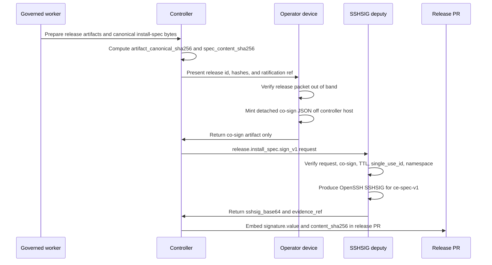
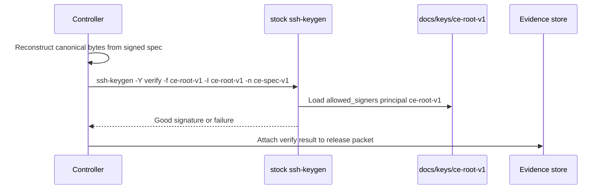

# SSHSIG Signing Deputy Design

Status: design-only

## Purpose

Move `ce-root-v1` release signing out of controller and worker custody now, while
preserving the existing installer trust chain. The deputy signs only
Operator-ratified release canonical bytes and emits the same OpenSSH SSHSIG
format that the installer already verifies with stock OpenSSH.

This applies to the current un-contained controller immediately. It is not
deferred to the contained-controller end state.

## Existing Trust Chain

The current install chain is already rooted in OpenSSH SSHSIG, not a CE-native
verifier:

- `docs/install.sh` fetches `docs/llms-install.md` and
  `docs/keys/ce-root-v1`, reconstructs canonical install-spec bytes by replacing
  the `signature.value` and `signature.content_sha256` lines with
  `<published-with-this-spec>`, checks the canonical SHA-256 against
  `signature.content_sha256`, base64-decodes `signature.value`, and runs
  `ssh-keygen -Y verify -f "$TRUST_ROOT_FILE" -I "$KEY_ID" -n "$NAMESPACE" -s
  "$SIG_FILE" <"$CANONICAL_FILE"`.
- That same script requires `algo: ssh-ed25519`, `key_id` present in the fetched
  allowed-signers trust root, and namespace `ce-spec-v1`.
- `docs/llms-install.md` documents the human verification recipe with
  `ssh-keygen -Y verify -f ce-root-v1 -I ce-root-v1 -n ce-spec-v1 -s
  ce-spec.sig < ce-spec.canonical`.
- `docs/contracts/installer.md` defines the served trust root
  `docs/keys/ce-root-v1`, the fixed namespace `ce-spec-v1`, and the
  canonical-bytes rule.
- `docs/delivery/VERSIONING_AND_RELEASE_POLICY.md` requires release owners to
  regenerate mirror hashes, reconstruct canonical install-spec bytes, sign those
  bytes with the approved OpenSSH signing key and namespace, embed the
  signature and digest, then independently verify before publication.

The signing deputy must therefore produce an OpenSSH detached SSHSIG over the
same canonical bytes and namespace. Generic OpenBao Transit signing output is
not sufficient unless the deputy wraps the signature into valid SSHSIG bytes
that stock `ssh-keygen -Y verify` accepts.

## Target Custody Model

`ce-root-v1` private key material is unavailable to controller seats and workers.
The only controller-visible authority is a signing request handle plus a signed
evidence record.

Preferred path:

- Store or reference the `ce-root-v1` signing operation behind OpenBao under the
  already documented governance path
  `ce-transit/governance/signing/ce-root-v1`.
- Expose only a deputy service endpoint that accepts a constrained signing verb.
- Keep OpenBao root, unseal, import, and key-use permissions outside controller
  seats and workers.
- Make the deputy SSHSIG-format-aware: it must construct the OpenSSH SSHSIG
  envelope for namespace `ce-spec-v1`, not return a raw Ed25519 signature.

Ratified bridge if OpenBao recovery blocks:

- Create a dedicated `ce-signer` OS user on a host not used as a controller seat.
- Place the private key under that user's home with mode `0700` directory and
  `0600` key file.
- Deny login shells and interactive controller access; expose only a locked-down
  local service or forced-command wrapper that implements the same verb API,
  co-sign checks, single-use ledger, evidence emission, and SSHSIG formatting.
- Treat this as temporary. The migration completion criterion is no private key
  readable by any controller or worker Unix account, including via shared groups,
  mounted home directories, or inherited sudo paths.

## Non-Goals

- No change to installer verification semantics.
- No key rotation design.
- No implementation in this unit.
- No handling, copying, probing, or validating private key material.

## Threat Model

| Threat | Control |
| --- | --- |
| Controller compromise signs an arbitrary install spec | Controller cannot read `ce-root-v1`; deputy requires ratification ref and Operator co-sign minted off-host. |
| Worker or PR author swaps mirror bytes after approval | Sign verb binds artifact canonical-bytes hash, install-spec content SHA, release id, and ratification ref; release verification still checks SHA256SUMS and signed manifest hashes. |
| Replay of an old Operator approval | Co-sign includes `expires_at`, `nonce`, and `single_use_id`; deputy records single use before signing and refuses reuse. |
| Operator approval copied from a controller host | Co-sign must be minted on an Operator-controlled device or channel never on a controller host; controller may only carry the detached artifact. |
| Deputy tricked into raw Vault/Transit signing | Deputy verifies request fields and emits OpenSSH SSHSIG for namespace `ce-spec-v1`; raw transit signatures are not accepted as release signatures. |
| Evidence becomes an approval substitute | Evidence record is value-free: it records identifiers, hashes, and verdicts only; it carries no private key material, no raw unsigned artifact bytes, and no Operator signing secret. |
| Namespace confusion | Deputy hard-codes or allow-lists `ce-spec-v1` for install-spec release signing and records the namespace in evidence. |
| Current un-contained controller remains trusted by habit | Release procedure changes immediately: controller prepares bytes and submits requests, but cannot sign locally or access `~/.ce-keys`. |

## Sign Verb API

Endpoint name: `release.install_spec.sign_v1`

Request fields:

```json
{
  "release_id": "0.3.4",
  "artifact_canonical_sha256": "<64-hex>",
  "spec_content_sha256": "<64-hex>",
  "ratification_ref": "operator-ratification:<id>",
  "operator_cosign": {
    "payload": {
      "release_id": "0.3.4",
      "content_sha256": "<64-hex>",
      "spec_content_sha256": "<64-hex>",
      "expires_at": "2026-07-06T19:30:00Z",
      "nonce": "<opaque-random>",
      "single_use_id": "release-0.3.4-install-spec-<opaque>",
      "operator_identity": "operator:<stable-id>"
    },
    "signature": "<detached-signature>",
    "signature_alg": "<operator-approved-alg>",
    "public_identity_ref": "<operator-public-identity-ref>"
  },
  "namespace": "ce-spec-v1",
  "key_id": "ce-root-v1",
  "canonical_bytes_ref": "<content-addressed-or-staged-ref>"
}
```

Required checks before signing:

- `namespace == "ce-spec-v1"` and `key_id == "ce-root-v1"`.
- `artifact_canonical_sha256` is the SHA-256 of the exact canonical bytes the
  deputy signs.
- `spec_content_sha256` matches the install spec's `signature.content_sha256`
  value to be embedded after signing.
- The Operator co-sign detached JSON verifies under an Operator-controlled
  identity, was minted off controller hosts, has not expired, and has not been
  used before.
- Co-sign `release_id`, `content_sha256`, and `spec_content_sha256` exactly
  match the sign request.
- `ratification_ref` resolves to the approved release action and names the same
  `release_id`.

Response fields:

```json
{
  "release_id": "0.3.4",
  "key_id": "ce-root-v1",
  "namespace": "ce-spec-v1",
  "artifact_canonical_sha256": "<64-hex>",
  "spec_content_sha256": "<64-hex>",
  "sshsig_base64": "<base64 OpenSSH SSHSIG bytes>",
  "evidence_ref": "signing-evidence:<id>"
}
```

The `sshsig_base64` value is what release tooling embeds as
`signature.value`. Consumers continue to verify with stock
`ssh-keygen -Y verify`.

## Operator Co-Sign Artifact

The co-sign artifact is detached signed JSON:

```json
{
  "release_id": "0.3.4",
  "content_sha256": "<64-hex>",
  "spec_content_sha256": "<64-hex>",
  "expires_at": "2026-07-06T19:30:00Z",
  "nonce": "<opaque-random>",
  "single_use_id": "release-0.3.4-install-spec-<opaque>",
  "operator_identity": "operator:<stable-id>"
}
```

Rules:

- Minted only on an Operator-controlled device or channel, never on a controller
  host.
- Short TTL; default target is minutes, not hours.
- Single-use; deputy stores `single_use_id` and refuses replay even before TTL
  expiry.
- Detached from the release bytes; it authorizes a specific hash tuple, not a
  mutable file path or branch.

## Evidence Record

Each signing act emits a value-free evidence record:

```json
{
  "schema": "ce.signing_deputy.evidence.v1",
  "release_id": "0.3.4",
  "key_id": "ce-root-v1",
  "namespace": "ce-spec-v1",
  "artifact_canonical_sha256": "<64-hex>",
  "spec_content_sha256": "<64-hex>",
  "ratification_ref": "operator-ratification:<id>",
  "operator_identity": "operator:<stable-id>",
  "operator_cosign_single_use_id": "release-0.3.4-install-spec-<opaque>",
  "operator_cosign_expires_at": "2026-07-06T19:30:00Z",
  "deputy_identity": "signing-deputy:<instance-id>",
  "custody_backend": "openbao:ce-transit/governance/signing/ce-root-v1",
  "verification_command_class": "ssh-keygen -Y verify",
  "result": "signed",
  "created_at": "2026-07-06T19:24:00Z"
}
```

The record must not include private key bytes, OpenBao tokens, unseal material,
raw canonical bytes, unsigned release artifacts, or Operator signing secrets.

## Release Ceremony



Verification after signing:



## Migration Path

1. Freeze direct signing from controller seats and workers. Any release needing
   `ce-root-v1` must use deputy ceremony or stop at the unsigned placeholder.
2. Inventory current release tooling and docs that instruct direct
   `ssh-keygen -Y sign`; replace operational practice first, then update prose
   in a follow-up implementation unit.
3. Bring up the bridge `ce-signer` service if OpenBao recovery is blocked.
   Confirm controller users cannot read the private key, cannot become
   `ce-signer`, and can only call the constrained sign verb.
4. Migrate to the OpenBao-backed deputy. The deputy remains responsible for
   SSHSIG formatting even if OpenBao performs the underlying Ed25519 operation.
5. Add release tooling integration that submits canonical bytes by content hash,
   embeds returned `sshsig_base64`, and runs the existing
   `ssh-keygen -Y verify` check before publication.
6. Retire any key-on-disk controller path. Final acceptance requires no
   controller or worker account access to `~/.ce-keys` or equivalent key
   material, and successful signing evidence from the deputy path.

## Open Operator Questions

- Which Operator-controlled identity and signature algorithm should be accepted
  for co-sign artifacts?
- What TTL should be ratified for co-sign artifacts, and does it vary by release
  class?
- Where should the single-use ledger and value-free evidence records live during
  the bridge phase and after OpenBao migration?
- What exact host is approved for the temporary `ce-signer` bridge if OpenBao
  recovery blocks?
- Is the deputy allowed to sign only `docs/llms-install.md` install-spec bytes,
  or should the verb name reserve space for future SSHSIG release artifact
  classes under separate namespaces?
- What out-of-band ratification reference format should the deputy resolve:
  issue comment, signed release packet, Operator ledger entry, or another
  canonical source?
